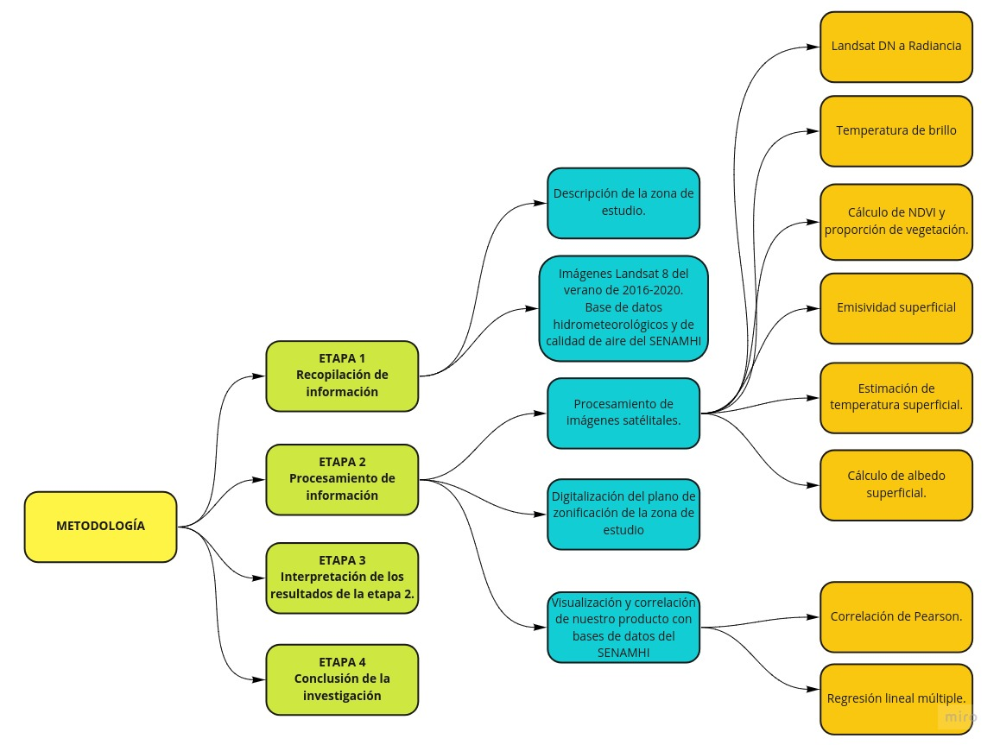
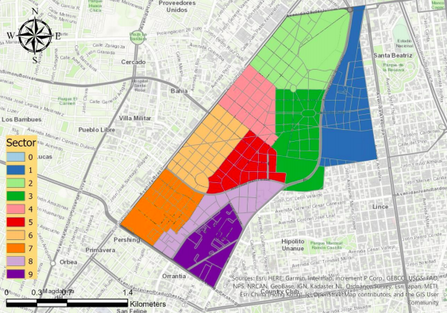
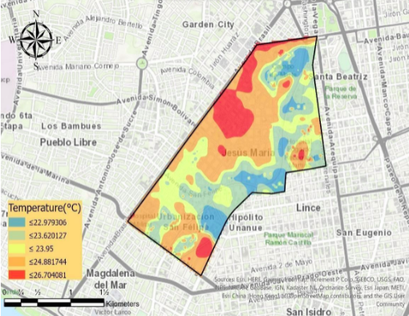
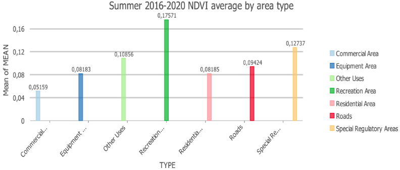

# Análisis de las variables que inciden en la formación de islas de calor urbanas de los últimos cinco veranos en la ciudad de Jesús María, Lima Metropolitana.

# Introducción

Podemos definir una isla de calor urbano en una ciudad cuando su equilibrio térmico se ve afectado por el aumento de la absorción de la radiación solar, el aumento del calor sensible liberado por las estructuras urbanas, la reducción de la vegetación en las ciudades y el aumento de la radiación infrarroja. Este calor adicional acumulado y liberado en el entorno urbano hace que la temperatura sea más alta en comparación con los alrededores, esto se conoce como isla de calor urbano (UHI). (Meneses T. e Iral P.; 2017).

Esas ciudades almacenan calor y aumentan la temperatura provocando varios daños que afectan la salud de las personas, la emisión de gases de efecto invernadero y el consumo de energía (Galindo et al; 2010).

## 1. Problemática

En la última década, el aumento poblacional en las ciudades ha generado una alta demanda de vivienda, para satisfacer y las áreas verdes (jardines y parques) han sido reemplazadas por condominios y edificios multifamiliares. Este cambio debido al sector de la construcción afecta el clima urbano produciendo un nuevo fenómeno, conocido como islas de calor urbano (Párraga, 2015). En Lima Metropolitana existen áreas predominantemente urbanas de la metrópoli, una de ellas es el distrito de Jesús María, donde podría estar ocurriendo el fenómeno de la isla de calor urbano (UHI).

## 2. Área de estudio

El distrito de Jesús María es uno de los 50 que conforman Lima Metropolitana, es un distrito de clase media, alta densidad y suele ubicarse entre los primeros distritos con mejor calidad de vida de Lima con un IDH de 0.770 (2005), solo detrás de los distritos de San Isidro y Miraflores. Está dividido en nueve sectores vecinales y es la sede de varios ministerios y embajadas. Además, cuenta con el parque más grande de Lima Metropolitana (Campo de Marte) y otros sitios de interés como sede y casa matriz.

En el caso de nuestro proyecto, el distrito dispone de una estación meteorológica automática que recoge variables hidrometeorológicas y datos de calidad del aire en el Campo de Marte, datos decisivos para analizar las variables que inciden en la formación de islas de calor urbanas.

## 3. Materiales y Métodos

Las imágenes satélites son proporcionadas por Landsat 8, estas son imágenes extraídas sin nubes y recortadas en el distrito de Jesús María a través de un script de Google Earth Engine filtrado en los meses de verano de 2016 a 2020.

Además, con base en la definición de nuestro problema, necesitamos un shapefile de los distritos peruanos en donde se encuentra el distrito de Jesús María, esto nos proporcionará una información geográfica proporcionado por el Instituto Geográfico Nacional del Perú.

```{r echo = FALSE, fig.align='center', comment='Figura 1. Metodología del Trabajo.'}

```

## 4. Recopilación de la información

### 4.1 Digitalización del plano de zonificación
En este apartado, produciremos información relevante dentro del distrito de Jesús María, digitalizando el planeamiento urbanístico del distrito y clasificándolo por sectores vecinales y por los tipos de áreas que predominan.
Según la Municipalidad de Jesús María se establecieron nueve sectores vecinales para una mejor administración.

```{r echo = FALSE, fig.align='center', comment='Figura 2. Sectores del barrio en el distrito de Jesús María'}

```

Según el Instituto Metropolitano de Planificación de la zonificación de usos del suelo en Lima Metropolitana se dividió el distrito de Jesús María en seis áreas principales.


* **Área comercial:** Son las áreas urbanas destinadas principalmente a la ubicación y operación de establecimientos para la compra - venta de productos y servicios.
* **Área de edificación:** Se refiere a las áreas urbanas destinadas a brindar servicios primarios como salud y educación. Los centros de salud, hospitales y escuelas se clasifican en esta área.
* **Área de otros usos:** ¿Son áreas urbanas destinadas principalmente a la habilitación y funcionamiento de instalaciones con fines especiales como museos, municipios, embajadas, oficinas centrales, etc.
* **Área de recreación:** Áreas que se encuentran en áreas urbanas o de expansión urbana destinadas principalmente a la realización de actividades recreativas activas y / o pasivas, tales como: Plazas, Parques, piscinas de agua, áreas verdes, y similares.
* **Barrio residencial:** Son áreas urbanas destinadas predominantemente al uso de vivienda y también pueden tolerar otros usos compatibles. Los planes de zonificación incluyen: Zona de alta densidad (RDA), Zona de densidad media (RDM) y Zona de baja densidad (RDB).
* **Área reguladora especial:** El propósito de las áreas urbanas se basa en la mejora urbana: descongestión, creación de dotaciones, saneamiento, problemas de circulación y otros problemas similares.

### 4.2 Variables hidrometeorológicas	

Las variables de temperatura, humedad relativa, precipitación, velocidad del viento fueron extraídas del sitio web oficial de SENHAMI mediante web scrapping en Python en las fechas disponibles desde 2015-05-01 hasta la fecha actual.

### 4.3 Calidad del aire en Campo de Marte

La calidad del aire se calcula mediante variables atmosféricas como la concentración de contaminación atmosférica: PM 2.5, PM10, O3, SO2, NO2 del sitio web oficial de SENHAMI en las fechas disponibles desde 2013-01-09 hasta la fecha actual.

## 5 Cálculo de variables

### 5.1 Temperatura de la superficie

La temperatura de la superficie mide la emisión de radiación térmica de la superficie terrestre donde la energía solar entrante interactúa y calienta el suelo (Glynn C. Hulley, 2019).

Esta variable es una de las más importantes debido a que proporciona una imagen más amplia de cómo se distribuye la temperatura en un área a diferencia de la temperatura obtenida de las estaciones meteorológicas.

### 5.2 Landsat DN a Radiance

Hay dos fórmulas que se pueden utilizar para convertir DN en luminosidad; el método que utilice depende de los datos de calibración de la escena disponibles en los archivos de encabezado. Un método utiliza los valores de ganancia y sesgo (o compensación) del archivo de encabezado. El otro método utiliza los factores de escala de radiancia espectral LMin y LMax.


Aunque, el método utilizado en Landsat 8 OLI / TIRS es como el método de ganancia y sesgo:

$$ L_{\lambda} = M_{\lambda} + Q_{cal} + A_{L}$$

Donde $L_{\lambda}$ es un resplandor y $M_{\lambda}$ y $A_{L}$ son Radiance Band Multiband y Add, respectivamente. La banda térmica utilizada en el Landsat 8 es la número 10 con su correspondiente DN $(𝑄_{cal})$. Estos datos se pueden encontrar en los metadatos de Landsat 8.

### 5.3 Radiación a temperatura de brillo en grados Celsius

$$ TB = \frac{K_{2}}{\ln([\frac{K_{1}}{L\lambda}])} - 273.15$$


Donde $K_{1}$ y $K_{2}$ representan la temperatura térmica específica de la banda	constantes de conversión de los metadatos y $L_{\lambda}$ es la banda de radiancia.


### 5.4 Temperatura de brillo a temperatura de superficie

$$ S_{T^{°}} = \frac{TB}{1+\lambda+(\frac{TB}{\rho}) * \ln(\varepsilon)} $$


Donde $TB$ es una temperatura de brillo, $\lambda$ es la longitud de onda de la radiancia emitida, $\rho$ es una constante calculada por esta ecuación:

$$ \rho = \frac{h *c}{\sigma} $$

Eso da como resultado $1.4388 × 10^{-2} m K$ o $14388 \mu m K$, donde 𝜎 es la constante de Boltzmann $(1.38 × 10^{−23} J / K)$, $h$ es la constante de Planck $(6.626 × 10^{−34} \ J s)$ y $c$ es la velocidad de luz $(2.998 × 10^{8} \frac{m}{s})$.
Y $\varepsilon$ es la emisividad de la superficie, que se explicará pronto.


### 5.5 Índice de vegetación de diferencia normalizada

Cuantifica la vegetación, su vigor y calidad, midiendo la diferencia entre el infrarrojo cercano (que la vegetación refleja fuertemente) y la luz roja (que la vegetación absorbe).
Usamos bandas infrarrojas y rojas para calcular el NDVI.

$$ NDVI = \frac{NIR_{b5}-RED_{b4}}{NIR_{b5}+RED_{b4}}$$


### 5.5 Emisividad superficial
Es un factor de proporcionalidad que escala el resplandor del cuerpo negro (ley de Planck) para predecir el resplandor emitido, y es la eficiencia de transmitir energía térmica a través de la superficie hacia la atmósfera (Jovanovska, 2016).

Para calcular la emisividad de la superficie (is) es importante comprender cómo funciona y cómo se relaciona con el NDVI:


$$NDVI < 0, \hspace{4em} \varepsilon = 0.991$$ 
$$0 \le NDVI \le 0.2, \hspace{4em} \varepsilon = 0.996$$
$$0.2 \le NDVI \le 0.5, \hspace{4em} \varepsilon = 0.996 + 0.004 + P_{v}$$
$$0.2 < NDVI, \hspace{4em} \varepsilon = 0.973$$
Donde $P_{v}$ es la fracción de cobertura de vegetación que equivale a:

$$ P_{v} = (\frac{NDVI-NDVI_{MIN \ VALUE}}{NDVI_{MAX \ VALUE} -NDVI_{MIN \ VALUE}})^2$$

### 5.6 Surface Albedo Shortwave


El albedo de superficie se define como la relación entre la radiosidad y la irradiancia (flujo por unidad de área) que recibe una superficie. La proporción reflejada no solo está determinada por las propiedades de la propia superficie, sino también por la distribución espectral y angular de la radiación solar que llega a la superficie de la Tierra (Coakley, 2003).

En este sentido, para la estimación de este parámetro se realizaron una serie de algoritmos para calcular el albedo de varios sensores satelitales con Landsat, donde la regresión lineal múltiple de mejor ajuste fue descrita y normalizada por Smith en 2010.

#### Radiancia a reflectancia TOA
Para Landsat 8

$$ \rho_{\lambda^{'}} = M_{p} + Q_{cal} + A_{p} $$


Donde $\rho_{\lambda^{'}}$ es reflectancia sin corrección del ángulo solar y $M_{p}$ y $A_{p}$ son bandas de reflectancia multibanda y **Add**, respectivamente. Las bandas utilizadas en el Landsat 8 son los números $1,3,4,5,7$ con su correspondiente DN $(Q_{cal})$. Esto Los datos se pueden encontrar en los metadatos de Landsat 8.

Para corregir esta reflectancia para cada banda, usaremos esta ecuación:

$$\rho_{\lambda} = \frac{\rho_{\lambda^{'}}}{\cos{\theta_{sz}}}$$
Donde:
* $\rho_{\lambda}$ es la reflectancia calculada con el ángulo corrección para cada banda $1,3,4,5,7$.
* $\theta_{sz}$ (ángulo cenital) es igual a 90 - ángulo de elevación del sol = 35.09 (en este caso)


#### Bandas de reflectancia al albedo de superficie

Una vez que haya llegado el momento de obtener la reflectancia, puede utilizar la fórmula que desarrolló. Su fórmula Landsat para calcular el albedo de superficie de onda corta.

$$\alpha = 0.356 + \rho_{\lambda_{1}} + 0.130 * \rho_{\lambda_{2}} + 0.085 +\rho_{\lambda_{5}} + 0.072 * \rho_{\lambda_{7}}$$

### 5.7 Limpieza de datos
Los datos del modelo calculado y los datos extraídos se encuentran en diferentes esquemas y están disponibles en diferentes fechas. Para ello, fusionaremos los datos en común y se eliminarán los datos no disponibles.

## 6. Análisis de los datos

### 6.1 Identificación de la isla de calor urbana

Cabe señalar que los datos calculados a partir del modelo son el resultado de la media de las imágenes de satélite por verano, es decir, para identificar las islas de calor urbanas, la temperatura debe ser superior a la media y en su entorno.

VERANO|ST MIN (° C)|ST MAX (° C)|ST PROMEDIO (° C)
------|-------------|------------|-----------------
2016  |21.58        |26,7        |23,95
2017  |26,89        |34,45       |30,42
2018  |21.16        |28.09       |24,88
2019  |23.52        |28,91       |26,32
2020  |23,87        |29,32       |26,6

```{r echo = FALSE, fig.align='center', comment='Figura 3 Verano de 2016: Islas de calor urbano en el distrito de Jesús María.'}

```
Y otras islas calor...


### 6.2 Interpretando los resultados de los datos calculados

a) El NDVI es mayor en áreas de recreación por tener áreas verdes y menor en áreas comerciales, así mismo los equipos y áreas residenciales tienen valores promedio bajos debido a su escasa o nula vegetación.

```{r echo = FALSE, fig.align='center', comment='Figura4. Verano 2016-2020 Promedio del NDVI por tipo de área.'}

```

b) Todas estas áreas tienen un albedo similar y con poca variación, el los promedios más altos de albedo son del equipo y especial áreas regulatorias, principalmente porque están pintadas en colores claros que reflejan el calor incidente. Por otro lado, las áreas de recreación y las calles construidas con asfalto tienen valores de albedo más bajos.


c) En el caso de la temperatura superficial, las áreas con alta temperatura valor son el área comercial y de equipos que superan fácilmente el promedio de cada verano, junto con áreas de Otros Usos y áreas cercanas para ellos, las zonas residenciales son las principales islas de calor urbanas.


## 7. Visualización y correlación de datos

### 7.1 Correlación de Pearson de variables calculadas

#### Verano 2016
Se observa una fuerte correlación negativa del $NDVI$ con la temperatura superficial, lo que significa que con menor presencia de vegetación, la temperatura aumenta. Además, el albedo superficial tiene una correlación positiva moderada, por lo que la temperatura podría aumentar con el albedo superficial.


° |ST|ALBEDO|NDVI
:-:|:-:|:----:|:----:
**ST**|21.58|26,7|23,95
**ALBEDO**|26,89|34,45|30,42
**NDVI**|21.16|28.09|24,88

#### Verano 2017
Es observadouna fuerte correlación negativa del NDVI con la temperatura superficial, lo que significa que con menor presencia de vegetación, la temperatura aumenta. Además, el albedo superficial tiene una correlación negativa débil, por lo que la temperatura no podría verse afectada por el albedo en este verano.

#### Verano 2018
Se observa una correlación negativa moderada del NDVI con la temperatura superficial, lo que significa que con menor presencia de vegetación, la temperatura podría aumentar. Además, el albedo de la superficie tiene una correlación negativa débil, por lo que la temperatura podría no verse tan afectada por el albedo en este verano

#### Verano 2019
Es observadouna fuerte correlación negativa del NDVI con la temperatura superficial, lo que significa que con menor presencia de vegetación, la temperatura aumenta. Además, el albedo de la superficie tiene una correlación positiva débil, por lo que la temperatura podría no verse tan afectada por el albedo en este verano.

#### Verano 2020
Es observadouna fuerte correlación negativa del NDVI con la temperatura superficial, lo que significa que con menor presencia de vegetación, la temperatura aumenta. Además, el albedo de la superficie tiene una correlación positiva débil, por lo que la temperatura podría no verse tan afectada por el albedo en este verano.

#### Resumen de Resultados
En la mayoría de los casos el NDVI tiene una correlación negativa moderada o fuerte con la Temperatura de la Superficie, así mismo el albedo de la superficie tiene una gran variación teniendo una correlación moderada o débil y positiva o negativa, por lo que es una variable no tan significativa al evaluar la temperatura de la superficie. . Finalmente, el NDVI y el albedo superficial siempre han tenido una fuerte correlación negativa en los últimos cinco veranos.

### 7.2 Visualización de datos extraídos

#### Datos Campo de Marte
En esta sección exploraremos las variables hidrometeorológicas y de contaminación del aire disponibles en la fecha de verano de esta estación.

Imagenes a pegar...


### 7.3 Correlación de variables

En la tabla que se muestra a continuación podemos relacionar las variables calculadas, en el píxel donde se ubica la estación, con la temperatura obtenida de la estación meteorológica. Podemos ver que existe una fuerte correlación positiva entre la temperatura obtenida de la estación con la temperatura superficial, así mismo la disminución del albedo traerá un aumento en ambas temperaturas y por último al estar la estación en una zona verde el NDVI no disminuirá con tiempo extraordinario.

Tabla de correlación...


## 8. Regresión lineal de variables
Con los datos extraídos disponibles, realizamos una regresión lineal múltiple para visualizar la influencia de las variables sobre la temperatura. Los resultados fueron los siguientes:

$$ T°_{2016}= 33.6102 + 0.0007 × PM_{10} + 0.0144 × O_{3} + 0.008 × NO_{2} + 0.6376 × CO - \\ \hspace{2em}1.1466 × Precipitation - 0.1415 × Humidity + 0.3609 × WindSpeed$$
Y las otras regresiones...


## 9. Interpretación de resultados

Primero, llegamos a la conclusión de que hay una adición de temperatura por los contaminantes del aire, a excepción de $PM_{2.5}$, que ha ido disminuyendo cada verano.
En segundo lugar, con las variables hidrometeorológicas: la precipitación, siendo casi nula y con pocos datos, tiene coeficientes altos, pero en teoría no puede contribuir a la temperatura. En cuanto a la humedad relativa disminuye con el aumento de temperatura y finalmente la velocidad del viento ha aumentado con la temperatura debido al calor es lo que mueve las masas de aire.

## 10. Discusión de resultados

El principal problema del proyecto es la falta de información referente a la base de datos del SENHAMI, por lo que se ajustó a las fechas establecidas de verano durante cinco años, así mismo las colecciones de imágenes satelitales solo se pudieron obtener en los meses de verano ya que es donde se la resolución más alta.

## 11. Conclusión

En resumen, en conclusión se identificaron las islas de calor urbano presentes principalmente en el ámbito comercial, de equipamiento, otros usos y áreas residenciales cercanas a las mismas.

El NDVI tiene una fuerte correlación negativa con la temperatura superficial y el Albedo superficial no presenta una gran correlación, mientras que con la temperatura obtenida de la estación meteorológica Campo de Marte tiene una buena correlación positiva con la temperatura superficial, así mismo el albedo superficial disminuye con el aumento de las temperaturas de la estación. En el caso de variables hidrometeorológicas:
La precipitación, siendo casi nula y con pocos datos, tiene altos coeficientes, pero en teoría no puede contribuir a la temperatura. En cuanto a la humedad relativa, disminuye con
aumentando la temperatura y finalmente la velocidad del viento ha aumentado con la temperatura debido al calor es lo que mueve las masas de aire.
Por último, hay una adición de temperatura por los contaminantes del aire, a excepción de $PM_{2.5}$, que ha ido disminuyendo cada verano.

## 12. Referencias
oakley, JA (2003). REFLEXIÓN Y ALBEDO, SUPERFICIE. Prensa académica, 10. FIQUITIVA, TZ (2017). ANÁLISIS ESPACIO-TEMPORAL DE VARIABLES QUE INCIDEN EN LA GENERACIÓN DE ISLA DE CALOR URBANA EN LA LOCALIDAD DE KENNEDY. UNIVERSIDAD SANTO TOMAS, SEDE BOGOTÁ.

Glynn C. Hulley, director general (2019). Tomando la temperatura de la tierra. Elsevier. Jovanovska, UA (2016). Algoritmo para el mapeo automatizado de la superficie terrestre Temperatura. Hindawi corporación editorial.

Párraga, VS (2015). IDENTIFICACIÓN DE ISLAS DE CALOR EN LA CIUDAD DE METROPOLITAN LIMA USANDO IMÁGENES SATELITALES 5TM. Universidad Nacional Agraria La Molina, Lima - Perú.

Smith, R. (2010). “El balance de calor de la superficie terrestre deducido del espacio”.

